# Core Workflows

Status: Design accepted for MVP.

Sequence diagrams for primary business and platform flows. Implementation blocked until Design gate approval.

See ADR-010, ADR-011, `MULTI_TENANCY.md`, `AUTHENTICATION_DESIGN.md`.

---

## 1. Tenant Provisioning (Super Admin)

Super Admin is the only provisioning path in MVP (OQ-009).

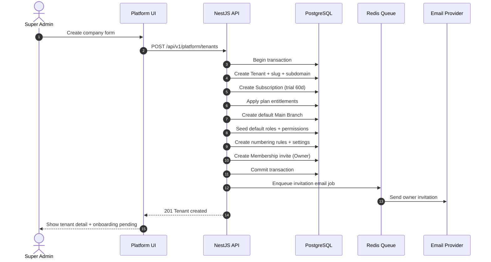

Failure rules:

- Duplicate slug → `409 DUPLICATE`
- Transaction rolls back on any step failure
- Re-submit with same idempotency key returns existing tenant (Implementation detail)

---

## 2. Company Owner Onboarding

Progress is saved. Tenant becomes operational when required steps complete.

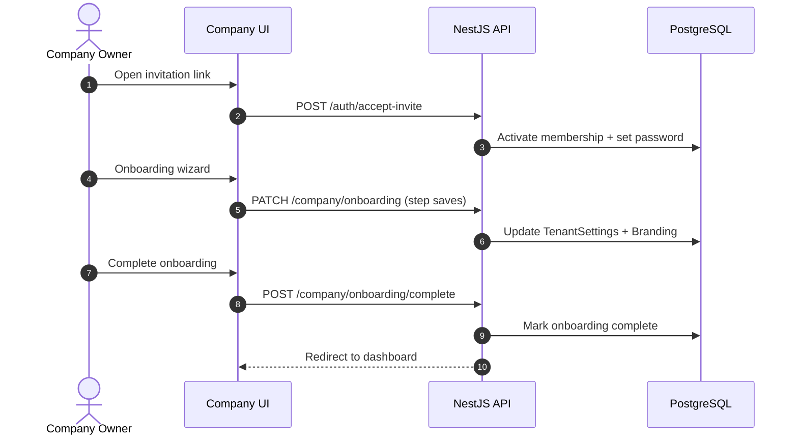

Onboarding steps (MVP):

1. Company profile confirmation
2. Branding (logo, colors)
3. Default currency, timezone, language
4. Tax and payment method defaults
5. Optional: first employee invite

---

## 3. Company Employee Login and Request Authorization

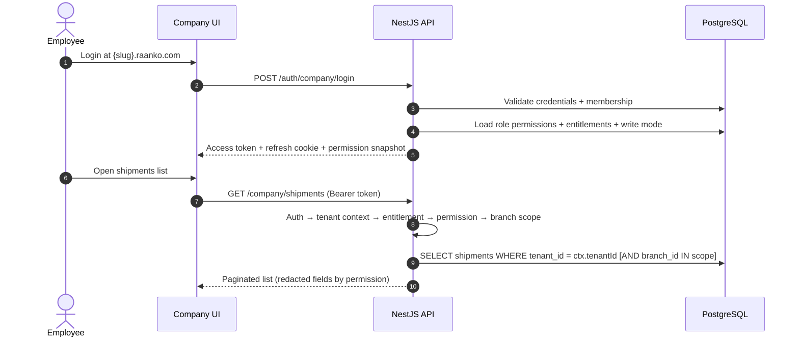

MVP: one active tenant per session. User must use correct subdomain (OQ-008 answered).

---

## 4. RFQ to Quote (Portal → Sales)

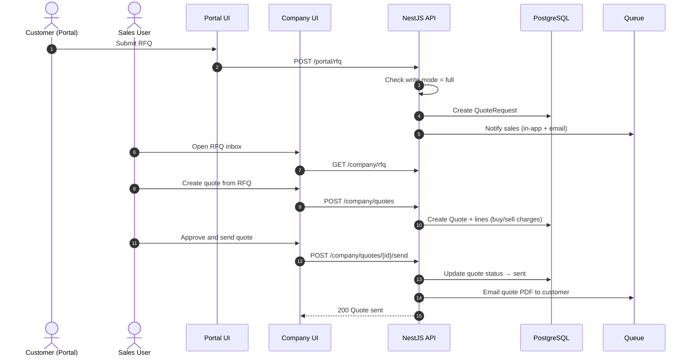

Read-only tenant: portal RFQ submit returns `403 TENANT_READ_ONLY`.

---

## 5. Quote Acceptance to Booking

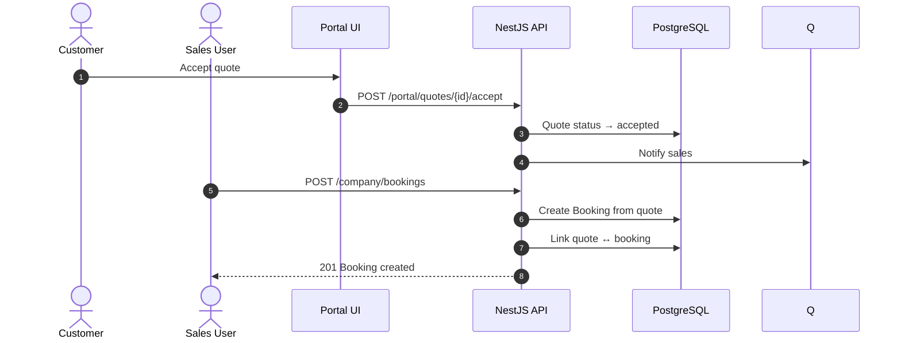

Beta constraint: one booking per accepted quote path.

---

## 6. Booking to Shipment (Operations)

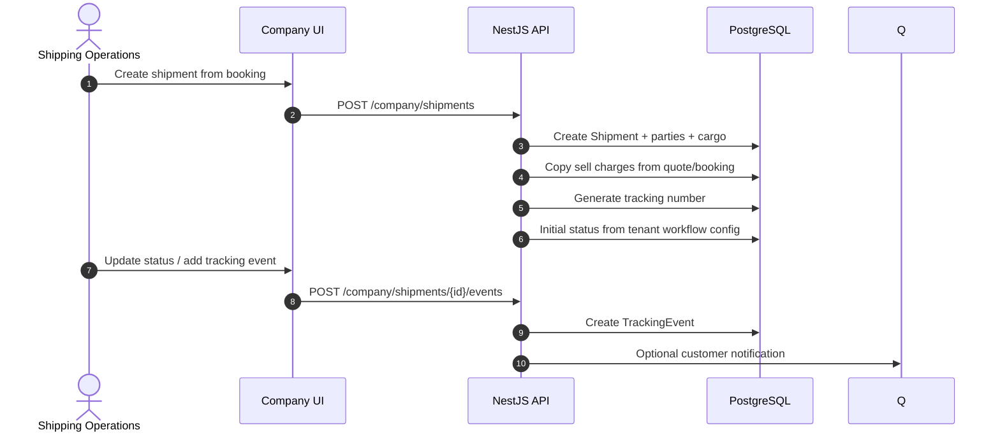

Alternate path (no quote):

```text
POST /company/shipments (direct) → skip quote/booking linkage
```

---

## 7. Direct Shipment Creation (No Quote)

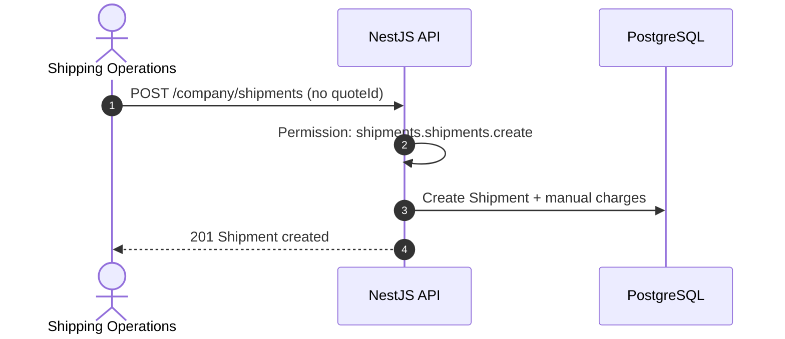

Profitability uses manually entered sell/supplier data when no quote exists.

---

## 8. Documents and Generated PDFs

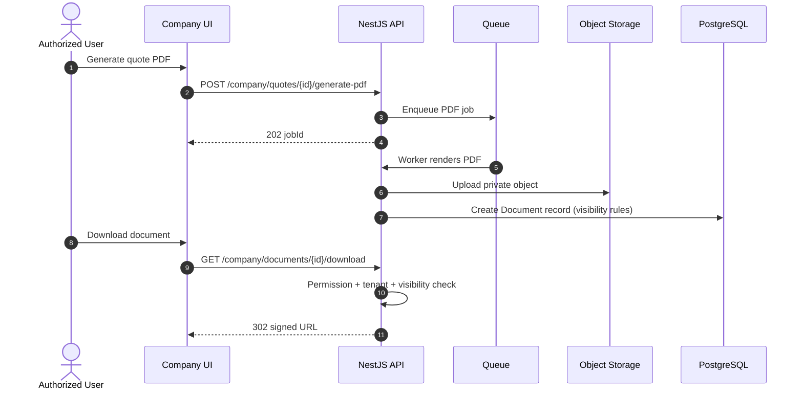

---

## 9. Customer Invoice and Payment

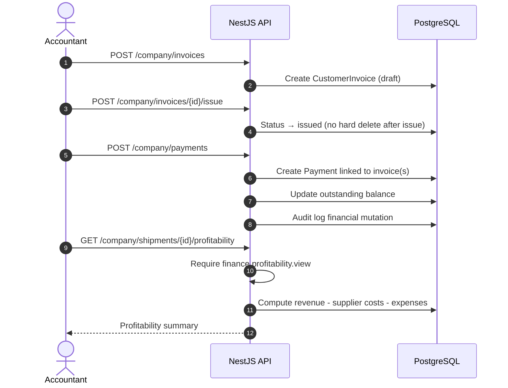

Corrections after issue: credit note flow, not hard delete.

---

## 10. Supplier Invoice and Profit Calculation

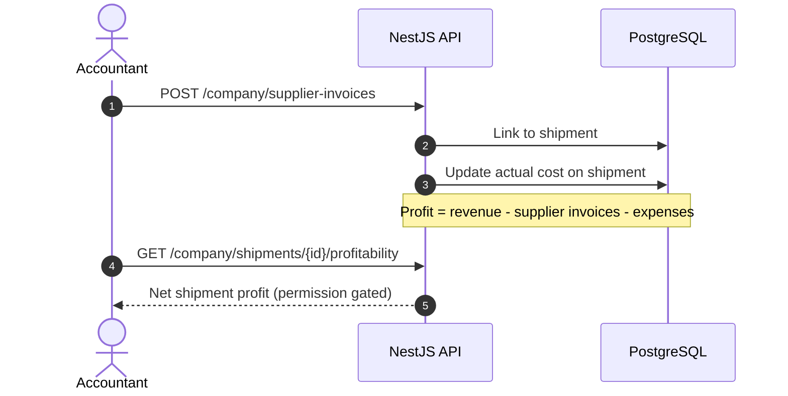

---

## 11. Public Tracking (Unauthenticated)

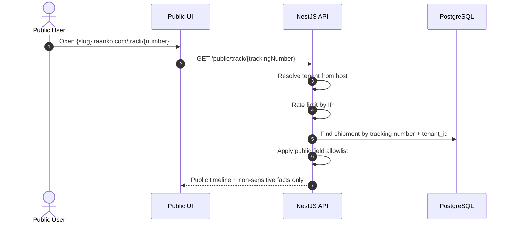

Suspended tenant: public tracking remains for existing/active shipments (ADR-011).

---

## 12. Excel Import Job

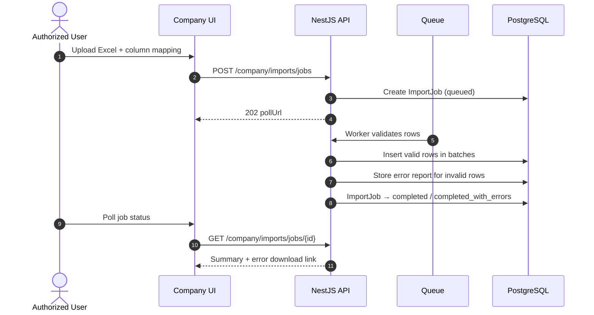

---

## 13. Tenant Lifecycle — Trial to Read-Only

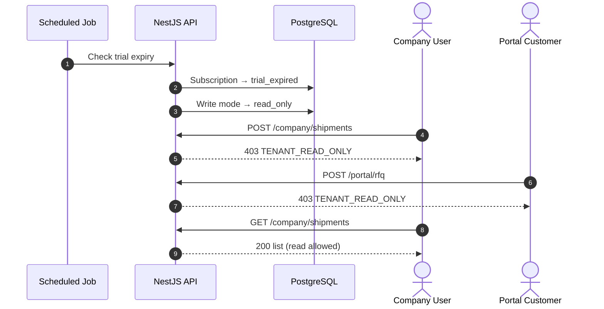

Super Admin manual activation restores full write mode.

---

## 14. Tenant Suspension

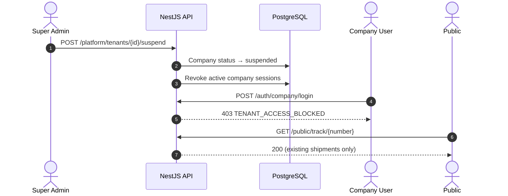

---

## 15. RAANKO Support Ticket

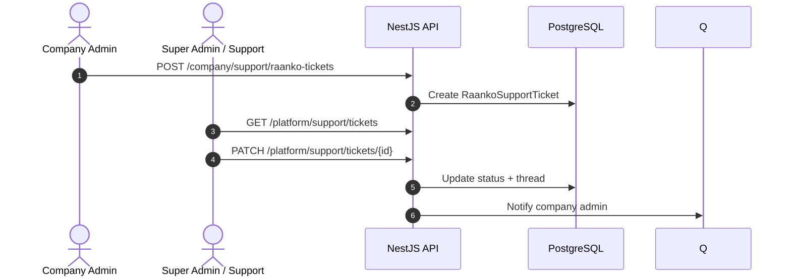

Separate from company customer support requests (`CompanySupportRequest`).

---

## Workflow Flexibility Summary

| Path | MVP Support |
|---|---|
| RFQ → Quote → Booking → Shipment | Yes |
| Quote → Shipment (skip explicit booking step) | Via booking creation |
| Direct Shipment (no quote) | Yes |
| Shipment → Invoice → Payment | Yes |
| Supplier invoice → Profit update | Yes |
| Credit note correction | Yes |
| Consolidation / Master-House | Future |

---

## Related Documents

- `UX_FLOWS.md`
- `API_CONTRACT_PRINCIPLES.md`
- `PERMISSIONS_MODEL.md`
