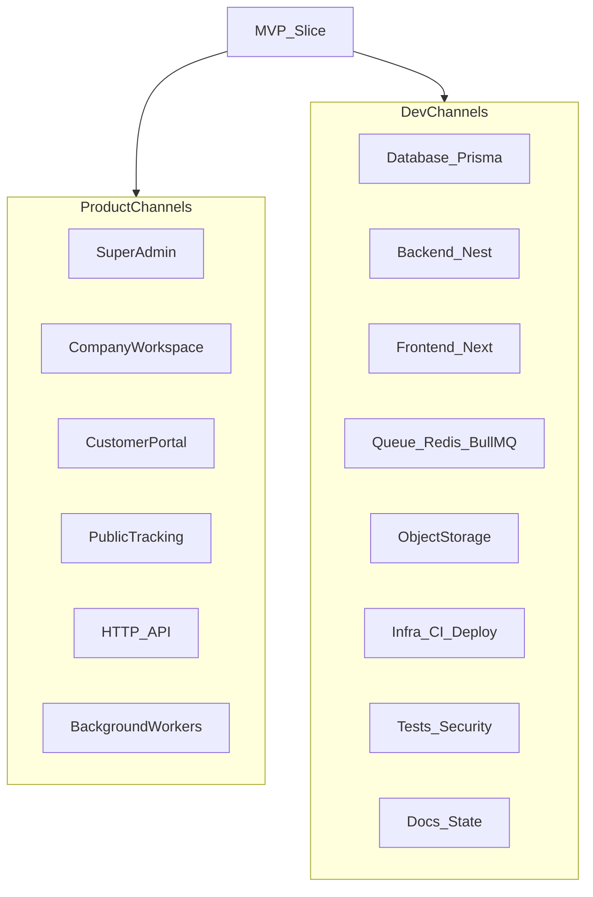

# خطة RAANKO المفصّلة — مراحل هندسية × قنوات عمل × شرائح

## Task Goal
تفصيل الخطة العامة إلى: (1) مراحل هندسة البرمجيات الخمس لكل عمل، (2) قنوات العمل كلها، (3) ما يُنفَّذ في كل شريحة MVP ثم Phase 2 ثم Future.

## Business Value
خطة تشغيل يومية للوكيل/الفريق دون خلط نطاق أو تخطي بوابات أو نسيان سطح/مسار تقني.

## Target Users
مالك المشروع، وكلاء التطوير.

## Confirmed Requirements
- نفس متطلبات الخطة العامة + أسطح UX في [UX_FLOWS.md](docs/architecture/UX_FLOWS.md)
- سير العمل في [DEVELOPMENT_WORKFLOW.md](docs/process/DEVELOPMENT_WORKFLOW.md) وبوابات [PHASE_GATES.md](docs/process/PHASE_GATES.md)
- شرائح [TASK-0002](tasks/active/TASK-0002-implementation-planning.md)

## Acceptance Criteria
- لا شريحة تنتقل للأمام دون بوابة مالك
- كل شريحة تغطي القنوات المتأثرة صراحة (لا «نسيّنا الـ Workers»)
- Future لا يدخل Implementation أثناء MVP

## Constraints / Assumptions / Open Decisions
كما في الخطة العامة (OQ-005 / 010 / 012 / 013 مفتوحة؛ القرارات Accepted معتمدة).

## تعريف «قنوات العمل» في هذه الخطة
يُستخدم تعريفان متكاملان:

**أ) قنوات المنتج (أسطح التشغيل)** — من يستعمل ماذا  
**ب) قنوات التطوير (مسارات التسليم التقني)** — من يبني ماذا  

كل شريحة تُخطَّط على تقاطعهما مع المراحل الخمس.

---

# الجزء أ — المراحل الهندسية الخمس (قالب إلزامي لكل شريحة)

يُطبَّق هذا القالب على كل Slice ولاحقاً على كل قدرة Phase 2 / Future. ممنوع القفز للأمام. موافقة المالك عند كل بوابة.

## أ.1 Analysis (Gate A) — ممنوع: تصميم نهائي متظاهر، ممنوع: كود

**مخرجات إلزامية قبل طلب الموافقة:**

1. ملخص الهدف الاثني عشر سؤالاً من `AGENTS.md`
2. تصنيف النطاق: MVP | Phase 2 | Future
3. المستخدمون والأسطح المتأثرة (قنوات المنتج)
4. متطلبات مؤكدة فقط من السياق/المتطلبات/ADR/تعليمات المالك
5. خارج النطاق لهذه الشريحة
6. قواعد عمل + حالات حدّية
7. صلاحيات ومالية و tenant impact
8. أسئلة مفتوحة أو Parked مع مخاطرة مقبولة
9. معايير قبول قابلة للاختبار

**قائمة تحقق القنوات في Analysis:**

- Super Admin: هل تتأثر إدارة المنصة؟
- Company: أي وحدات شريط جانبي/تدفقات؟
- Portal: هل يظهر شيء للعميل؟
- Public Tracking: هل يتأثر التتبع العام؟
- API: أي أسطح auth مطلوبة؟
- Workers: بريد/PDF/استيراد/تصدير؟
- DB/BE/FE/Q/Storage/CI/QA/Docs: هل يلزم عمل تقني لاحقاً؟

**خروج:** موافقة مالك على Analysis.

## أ.2 Design (Gate B) — ممنوع: Implementation

**مخرجات إلزامية:**

1. حدود الوحدة (module) والعقود الداخلية
2. كيانات Prisma لهذه الشريحة فقط + GLOBAL vs TENANT_SCOPED
3. علاقات، فهارس مبدئية، soft-delete حيث ينطبق
4. عقود API (مسارات، أخطاء، ترقيم صفحات، شكل الرد)
5. Tenant resolution + object-level auth
6. مفاتيح صلاحيات من `PERMISSIONS_MODEL.md` (لا اختراع مفاتيح بلا تحديث النموذج)
7. تأثير entitlements / write-mode (full vs read-only vs suspended)
8. وظائف خلفية، ملفات، كاش، إشعارات إن وُجدت
9. هيكل UI للأسطح المتأثرة (بدون Future extras)
10. تهديدات أمنية ذات صلة بالشريحة
11. استراتيجية ترحيل/rollback لهذه الجداول فقط
12. خطة اختبارات الشريحة (عزل مستأجر من S2+)

**خروج:** موافقة مالك على Design.

## أ.3 Implementation (Gate C) — هنا يبدأ الكود

**ترتيب التنفيذ داخل الشريحة (من workflow):**

1. Database (Prisma migrate للشريحة)
2. Backend domain + repositories مع tenant context
3. Permissions / guards / policies
4. API controllers وفق العقود
5. Frontend للأسطح المعنية
6. Integrations (بريد/تخزين) عند الحاجة
7. Automated tests المطلوبة في الشريحة
8. تحديث وثائق الحالة (`CURRENT_STATE` / `CHANGELOG`؛ docs/modules عند دخول وحدة Implementation)

**قواعد:** كل تغيير يربط بمتطلب + معيار قبول؛ لا Future أثناء MVP.

**خروج:** تغيير قابل للمراجعة والاختبار.

## أ.4 Refinement (Gate D) — ممنوع: ميزات جديدة

مسموح فقط: UX، أداء، أخطاء أوضح، حالات حدّية ضمن النطاق، إزالة تكرار، a11y، استجابة، فهارس، صلابة أمنية، جودة اختبارات.

أي فكرة جديدة → ترجع إلى Analysis كمهمة منفصلة.

**خروج:** موافقة على أن بنود التحسين المتفق عليها اكتملت.

## أ.5 Review (Gate E)

مراجعة: وظيفية، قواعد عمل، كود، أمن، عزل مستأجر، صلاحيات، دقة مالية إن لزم، UI، انحدار، وثائق، Definition of Done.

**نتيجة رسمية واحدة فقط:** Approved | Approved With Minor Notes | Returned To Analysis/Design/Implementation/Refinement.

بعد Approved: تحديث الحالة؛ ثم فقط الانتقال للشريحة التالية.

---

# الجزء ب — قنوات المنتج (أسطح التشغيل) — تفصيل

المرجع: [UX_FLOWS.md](docs/architecture/UX_FLOWS.md)، [SYSTEM_ARCHITECTURE.md](docs/architecture/SYSTEM_ARCHITECTURE.md).

## ب.1 قناة Super Admin — `(platform)` / `admin.raanko.com`

| البعد | التفصيل |
|------|---------|
| المستخدمون | Platform Admin، Support Agent |
| Auth | منصة منفصلة؛ 2FA TOTP إلزامي قبل إنتاج Beta |
| Tenant | لا عضوية شركة؛ استعلامات platform صريحة فقط |
| وظائف MVP | شركات، خطط/اشتراكات/overrides، استخدام، دورة حياة، تذاكر RAANKO، إعدادات عامة، audit منصة |
| لا يفعل | عمليات شحن يومية للشركة إلا بصلاحية دعم مخصصة لاحقاً (Phase 2: impersonation) |
| شرائح أساسية | S2 (login)، S3 (provisioning/lifecycle)، S12 (تذاكر)، S14 (2FA/prod) |

**مسار مرحلة نموذجي لهذه القناة:** Analysis يحدد صلاحيات `platform.*` → Design لواجهات وAPIs المنصة → Implementation لـ `(platform)` routes → Refinement لكثافة تشغيلية → Review عزل platform≠company.

## ب.2 قناة Company Workspace — `(company)` / `{slug}.raanko.com`

| البعد | التفصيل |
|------|---------|
| المستخدمون | Owner، Admin، Branch Manager، Sales، Operations، Finance، Customer Service |
| Auth | شركة على subdomain؛ جلسة مستأجر واحد (لا switcher في MVP) |
| Shell | شعار المستأجر، بحث، إشعارات، شريط جانبي حسب صلاحيات |
| حالات الشريط | عادي / read-only banner / تحذير انتهاء التجربة |
| وحدات MVP | Dashboard، Customers، Quotes/RFQ، Bookings، Shipments، Documents، Finance، Suppliers، Reports، Support، Settings |
| شرائح | S2–S12 تدريجياً حسب الوحدة؛ S14 E2E |

**Branch Manager:** نطاق فرع إلزامي من S4؛ القوائم تُفلتر من السيرفر.

## ب.3 قناة Customer Portal — `{slug}.raanko.com/portal`

| البعد | التفصيل |
|------|---------|
| المستخدمون | مستخدمو حساب العميل |
| Auth | portal auth منفصل؛ لا RBAC أدوار موظفين |
| يظهر | شحنات، عروض (عرض/قبول)، فواتير، RFQ، مستندات مرئية، دعم الشركة |
| لا يظهر أبداً | buy price، margin، ملاحظات داخلية، مستندات داخلية |
| write-mode | عند read-only: إخفاء إرسال RFQ + بانر؛ عند suspended: بوابة read-only حسب ADR-011 |
| شرائح | أساسيات من S7/S8/S9/S10/S12؛ اكتمال S13 |

## ب.4 قناة Public Tracking — `(public)/track`

| البعد | التفصيل |
|------|---------|
| المستخدمون | زوار بدون حساب |
| Auth | لا |
| Tenant | subdomain + رقم تتبع |
| محتوى | قائمة حقول مسموحة فقط؛ لا مالية/حساسة |
| Suspension | يبقى يعمل للشحنات النشطة (ADR-011) |
| شرائح | S8 أساسي؛ S14 rate limit |

## ب.5 قناة HTTP API — `/api/v1`

| البعد | التفصيل |
|------|---------|
| العملاء | واجهات الويب؛ تكاملات لاحقاً (Phase 2 webhooks واردة/صادرة منفصلة) |
| Auth | حسب سطح العميل (platform / company / portal) |
| قواعد | versioned؛ pagination؛ أخطاء موحّدة؛ لا تسريب حقول مالية عبر DTO |
| شرائح | كل شريحة تضيف مساراتها؛ عزل الأسطح من S2 |

## ب.6 قناة Background Workers

| البعد | التفصيل |
|------|---------|
| التقنية | Redis + BullMQ |
| سياق | `tenant_id` موثوق من حمولة المهمة — لا من الطلب العام |
| مهام MVP | بريد، استيراد Excel، توليد PDF، تصدير كبير، إشعارات |
| شرائح | S3 دعوات؛ S5/S6 استيراد؛ S7/S9/S10 PDF؛ S11 تصدير؛ S12 بريد/إشعارات |

---

# الجزء ج — قنوات التطوير (مسارات التسليم)

## ج.1 Database / Prisma
- ترحيل لكل شريحة فقط؛ لا مخطط كامل مسبقاً
- ULID؛ `tenant_id` على TENANT_SCOPED؛ UTC
- soft-delete للكيانات المحمية حسب التصميم
- لا حذف نهائي للمستأجر قبل OQ-010

## ج.2 Backend NestJS (`apps/api`)
- وحدات متوافقة مع حدود ADR-010
- middleware سياق المستأجر؛ guards أسطح؛ policies صلاحيات
- فصل خدمات مالية عن تشغيلية عند الحاجة

## ج.3 Frontend Next.js (`apps/web`)
- مجموعات مسارات: `(platform)` `(company)` `(portal)` `(public)`
- i18n AR/EN + RTL؛ عملة EUR افتراضياً
- إخفاء عناصر القائمة بدون صلاحية (وليس ودجات فارغة)

## ج.4 Queue / Cache
- طوابير مفصولة بالاسم؛ إعادة محاولة؛ فشل ظاهر في UI للمستخدم المصرّح

## ج.5 Object Storage
- مرفقات خاصة؛ روابط موقعة؛ لا اعتماد على URL مباشر للدلو

## ج.6 Infra / CI / Deploy
- Compose محلي؛ GitHub Actions؛ staging على PaaS في S14؛ Cloudflare للـ DNS/edge

## ج.7 Tests / Security
- Vitest؛ Playwright لمسارات حرجة في S14
- من S2: عزل مستأجر + عزل أسطح
- مالية: redaction + لا hard-delete

## ج.8 Docs / State
- تحديث `CURRENT_STATE.md` و`CHANGELOG.md` بعد كل Review
- `docs/modules/<module>/` عند دخول الوحدة Implementation فقط
- لا ملفات `.md` جديدة بلا طلب مالك أو مطلب حوكمة للمهمة

---

# الجزء د — مصفوفة MVP: كل شريحة × مراحل × قنوات

لكل شريحة أدناه: **Analysis → Design → Implementation → Refinement → Review** إلزامي. يُذكر ما يخص كل قناة فقط إن تأثرت.

## Slice 1 — Scaffold and Dev Environment

| مرحلة | العمل |
|------|------|
| Analysis | تأكيد monorepo وحدود apps/packages؛ خارج النطاق: أي منطق أعمال |
| Design | هيكل مجلدات، سكربتات pnpm، Compose، نمط env، CI jobs، health contract |
| Implementation | إنشاء/إكمال `apps/api`، `apps/web`، `packages/shared`؛ Prisma baseline؛ CI؛ health |
| Refinement | سرعة إقلاع، وضوح README تشغيل محلي إن وُجد مسبقاً ضمن المهمة المعتمدة فقط |
| Review | `compose up` + dev + CI أخضر |

**قنوات:** Infra/CI/DB/BE/FE فقط. لا Super Admin/Company/Portal وظائف.

## Slice 2 — Identity and Auth Foundation

| مرحلة | العمل |
|------|------|
| Analysis | أسطح login الثلاثة؛ جلسات؛ refresh؛ أحداث دخول؛ 2FA منصة |
| Design | كيانات User/Session/RefreshToken؛ عقود auth؛ guards؛ cookie refresh؛ subdomain match |
| Implementation | BE auth + FE صفحات login لكل سطح؛ middleware مستأجر؛ تسجيل نشاط |
| Refinement | رسائل خطأ عامة (لا enumeration)؛ UX انتهاء الجلسة |
| Review | اختبارات عزل سطح ومستأجر + دوران refresh |

**قنوات منتج:** Platform + Company + Portal (login فقط). Public: لا. Workers: لا أساسي.  
**قنوات تطوير:** DB/BE/FE/QA أساساً.

## Slice 3 — Super Admin and Tenant Provisioning

| مرحلة | العمل |
|------|------|
| Analysis | مسار إنشاء شركة؛ دورة حياة؛ trial 60؛ بذور أدوار؛ دعوة مالك |
| Design | معاملة provisioning؛ entitlements؛ seed matrix؛ وظيفة بريد الدعوة |
| Implementation | Platform UI شركات + APIs؛ lifecycle؛ queue بريد؛ أعلام write-mode |
| Refinement | وضوح حالات الشركة في القائمة؛ تأكيدات suspend |
| Review | rollback provisioning؛ منع login عند suspend؛ GET-only في read-only |

**قنوات:** Super Admin كاملة لهذه الشريحة؛ Company login يتأثر بالـ lifecycle؛ Worker بريد؛ API platform.

## Slice 4 — Onboarding and Organization

| مرحلة | العمل |
|------|------|
| Analysis | معالج onboarding؛ فروع؛ موظفين؛ أدوار؛ نطاق فرع؛ علامة تجارية |
| Design | جداول Branch/Membership/Role؛ سياسات branch scope؛ إعدادات شركة |
| Implementation | Company shell أولي؛ settings؛ دعوات موظفين؛ قبول دعوة |
| Refinement | حفظ تقدم المعالج؛ كثافة شاشات الإعداد |
| Review | 403 سيرفر؛ فلتر Branch Manager |

**قنوات:** Company أساساً؛ Portal/Public لا؛ API company؛ Worker دعوات إضافية إن لزم.

## Slice 5 — CRM

| مرحلة | العمل |
|------|------|
| Analysis | عملاء؛ أنشطة؛ استيراد؛ تصدير؛ تكرار |
| Design | نموذج Customer/Activity؛ وظيفة استيراد Excel |
| Implementation | قوائم/تفاصيل؛ استيراد async؛ تصدير حسب صلاحية |
| Refinement | بحث وفلاتر؛ تحذيرات التكرار |
| Review | تخمين ID عبر مستأجر؛ تقرير أخطاء الاستيراد |

**قنوات:** Company؛ Worker استيراد؛ API؛ لا Portal كامل بعد (ربط لاحق).

## Slice 6 — Suppliers and Rates

| مرحلة | العمل |
|------|------|
| Analysis | موردون؛ أسعار شراء؛ قوالب رسوم؛ صلاحية buy prices |
| Design | redaction في DTO؛ استيراد أسعار |
| Implementation | CRUD + import؛ إخفاء حقول بدون صلاحية |
| Refinement | وضوح فروقات sell-only للمبيعات إن لزم ضمن ADR-014 |
| Review | اختبارات redaction |

**قنوات:** Company + API + Worker استيراد. Portal/Public: لا أسعار شراء.

## Slice 7 — Quotes and RFQ

| مرحلة | العمل |
|------|------|
| Analysis | RFQ→Quote؛ نسخ؛ موافقة؛ هامش؛ إشعار |
| Design | إصدارات العرض؛ خطوط الرسوم؛ وظيفة PDF stub؛ أحداث إشعار |
| Implementation | RFQ inbox؛ محرر عرض؛ صلاحيات approve/margins؛ بوابة RFQ أولية إن جاهزة جزئياً |
| Refinement | timeline الحالة؛ تعطيل أزرار في read-only |
| Review | مسار RFQ→quote؛ إخفاء هامش؛ حظر كتابة portal في read-only |

**قنوات:** Company + Portal (RFQ/عرض جزئي) + Workers PDF/بريد + API.

## Slice 8 — Bookings, Shipments, Public Tracking

| مرحلة | العمل |
|------|------|
| Analysis | حجز؛ شحنة مباشرة؛ workflow حالات؛ أحداث تتبع؛ allowlist عام |
| Design | كيانات شحنة/أطراف/حاويات/أحداث؛ انتقالات حالة؛ عقد التتبع العام |
| Implementation | Company تدفقات؛ Public tracking page؛ عزل رقم التتبع |
| Refinement | فلاتر قائمة الشحنات؛ أخطاء انتقال غير صالح |
| Review | لا مالية في العام؛ استمرار التتبع عند suspend |

**قنوات:** Company + Public + API. Portal عرض شحنات يُكمَل في S13.

## Slice 9 — Documents

| مرحلة | العمل |
|------|------|
| Analysis | رفع؛ رؤية customer vs internal؛ PDF مولَّد |
| Design | metadata؛ تخزين R2؛ روابط موقعة؛ سياسات الرؤية |
| Implementation | رفع/معاينة/تنزيل؛ ربط بعرض/شحنة؛ PDF عروض |
| Refinement | معاينة؛ رسائل فشل الرفع |
| Review | رفض تنزيل غير مصرح؛ عزل مستأجر |

**قنوات:** Company + Portal (مرئي للعميل) + Storage + Worker PDF + API. Public: لا مستندات داخلية.

## Slice 10 — Finance

| مرحلة | العمل |
|------|------|
| Analysis | فواتير؛ مدفوعات؛ مصروفات؛ credit notes؛ ربحية؛ صرف يدوي |
| Design | حالات الفاتورة؛ منع hard-delete؛ audit مالي؛ صلاحيات finance.* |
| Implementation | وحدات Finance في Company؛ حساب ربحية؛ PDF فاتورة/إيصال |
| Refinement | تأكيدات مالية؛ وضوح الأرصدة المستحقة |
| Review | فصل صلاحيات؛ دقة ربح؛ audit |

**قنوات:** Company (Finance) + Portal (فواتير عميل بدون داخلي) + Workers PDF + API. Super Admin: لا دفاتر الشركة.

## Slice 11 — Dashboard, Reports, Search

| مرحلة | العمل |
|------|------|
| Analysis | ودجات؛ تقارير؛ بحث عالمي مستأجر؛ تصدير |
| Design | بوابات صلاحية لكل ودجة؛ بحث scoped بالفرع |
| Implementation | لوحة؛ تقارير؛ بحث؛ تصدير async للكبير |
| Refinement | كثافة تشغيلية؛ إخفاء بلا صلاحية |
| Review | عزل بحث؛ gating ربحية |

**قنوات:** Company أساساً؛ Worker تصدير؛ API.

## Slice 12 — Notifications and Support

| مرحلة | العمل |
|------|------|
| Analysis | تغذية داخلية؛ بريد؛ تفضيلات؛ دعم عملاء الشركة ≠ تذاكر RAANKO |
| Design | نماذج إشعار/تذكرة؛ فصل المسارين؛ deep links |
| Implementation | جرس إشعارات؛ طابور بريد؛ شاشات دعم Company + Platform tickets |
| Refinement | تجميع إشعارات؛ وضوح الحالات |
| Review | نطاق مستأجر للتذاكر؛ تسليم وظيفة |

**قنوات:** Company + Portal دعم + Super Admin تذاكر + Workers بريد.

## Slice 13 — Customer Portal Complete

| مرحلة | العمل |
|------|------|
| Analysis | اكتمال كل تدفقات البوابة تحت علامة الشركة |
| Design | shell portal؛ توحيد redaction؛ UX read-only |
| Implementation | تكامل RFQ/عروض/شحنات/فواتير/مستندات/دعم |
| Refinement | استجابة موبايل للبوابة؛ بانرات الحالات |
| Review | suite redaction + عزل portal token عن company API |

**قنوات:** Portal محور؛ API portal؛ لا تسريب لـ Company modules.

## Slice 14 — Beta Hardening and Release

| مرحلة | العمل |
|------|------|
| Analysis | قائمة إطلاق Beta؛ مخاطر OQ-012؛ Staging |
| Design | خطة اختبارات شاملة؛ rate limits؛ إعدادات 2FA إنتاج |
| Implementation | suites عزل/صلاحيات؛ Playwright مسار عرض→شحنة→فاتورة؛ نشر staging؛ مراقبة (Recommendation) |
| Refinement | إصلاحات إطلاق فقط ضمن ملاحظات متفق عليها |
| Review | Release Done عملي لـ Beta |

**قنوات:** كل الأسطح + Infra + QA. الإغلاق التجاري العام مؤجل حتى OQ-005 و OQ-013.

---

# الجزء هـ — مراحل منتج الطريق (Roadmap) مفصّلة بالقنوات

## ه.1 Phase 0–2 (مكتملة تقريباً)
Governance + Analysis + Foundation Design: وثائق وADR. لا إعادة فتح إلا عند تعارض جديد يُرفع للمالك.

## ه.2 Phase 3–4 (MVP + Hardening)
تنفيذ الأجزاء د + Slice 14 + تشغيلات Beta.

**قبل Commercial Launch العام:** إجابة OQ-005 و OQ-013.  
**قبل Permanent Delete:** OQ-010.

## ه.3 Phase 5 — Phase 2 Product (بعد MVP Phase Done)

كل قدرة تمر بالمراحل الخمس. تفصيل القنوات:

| قدرة | SuperAdmin | Company | Portal | Public | API | Workers |
|------|------------|---------|--------|--------|-----|---------|
| Custom domain | إعداد DNS/تحقق | علامة/حالة النطاق | يعمل على النطاق | يعمل على النطاق | tenant resolve | تجديد شهادات إن لزم |
| Custom email sender | حدود/موافقة | إعداد المرسل | بريد من المرسل | — | إعدادات | إرسال |
| Webhooks | مراقبة منصة اختيارية | إدارة endpoints | — | — | توقيع/إعادة محاولة | تسليم أحداث |
| Usage أوسع | لوحات استخدام | عرض حدود | — | — | meters | تجميع |
| Billing أغنى (بعد OQ-005) | خطط/أسعار | اشتراك/فواتير منصة | — | — | billing APIs | فوترة |
| Impersonation | بدء جلسة دعم + audit ظاهر | بانر impersonation | — | — | platform-only | — |
| Consolidation | — | مسار عمل | رؤية محدودة إن لزم | تتبع مرتبط | APIs | — |
| CSV + doc versioning | — | تصدير/إصدارات | إصدارات مرئية للعميل إن سُمح | — | APIs | تصدير |
| Tenant switcher | — | تبديل عضوية | — | — | membership list | — |

## ه.4 Phase 6 — Future Platform

وحدات كبيرة؛ كل منها مشروع فرعي بدورة كاملة. توجيه القنوات:

- **Warehouse / Inventory / Fleet / GPS:** Company (+ Operations mobile لاحقاً)؛ Workers تتبّع؛ Public قد يعرض حدث GPS لاحقاً دون بيانات حساسة
- **Driver / Customer / Ops apps:** قنوات موبايل جديدة؛ نفس عزل المستأجر عبر API
- **Carrier/Airline/Vessel/Flight APIs:** Workers مزامنة؛ Company عرض؛ لا كسر الحدود
- **WhatsApp/SMS:** Workers قنوات إشعار إضافية
- **QuickBooks/Xero / Payment gateways / E-sign:** Finance Company + Workers؛ صلاحيات مالية مشددة
- **AI documents/pricing/insights:** Company بمراجعة بشرية؛ لا تنفيذ في MVP؛ لا تسريب لـ Portal بدون سياسة

---

# الجزء و — طقس العمل اليومي للوكيل

1. افتح الشريحة الحالية فقط
2. املأ قالب المرحلة الحالية (أ.1–أ.5)
3. حدّد قنوات المنتج والتطوير المتأثرة (ب + ج)
4. نفّذ ضمن المرحلة فقط
5. اعرض على المالك → انتظر الموافقة قبل البوابة التالية
6. بعد Review معتمد: حدّث الحالة ثم الشريحة التالية

**فوري بعد اعتماد هذه الخطة:** اعتماد TASK-0002 → Slice 1 Analysis/Design إن لزم ثم Implementation.

---

# ملاحظة
لا تُنشأ ملفات `.md` جديدة في المستودع إلا بطلبك الصريح أو تحديث ملفات الحوكمة الموجودة ضمن مهمة معتمدة.
